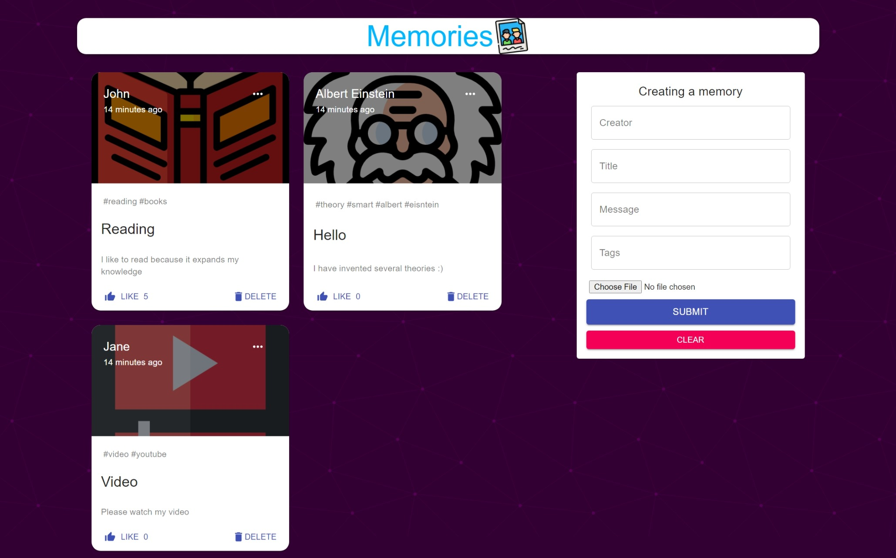

# memories-web-app

## [Website:](https://tjh-memories-app.netlify.app/)

## Tech Stack:

- React to build front end

- Express.js to handle back end api

- MongoDB to store and retrieve data

- Redux to store the global state of the application

## What can be done:

- Allow users to `create`, `edit` and `delete` posts

- Allow anyone to `like` and `view` posts

## What I added:

- Login authentication needed to create, edit or delete posts (signup disabled to prevent troll posts, contact me to get the credentials)

